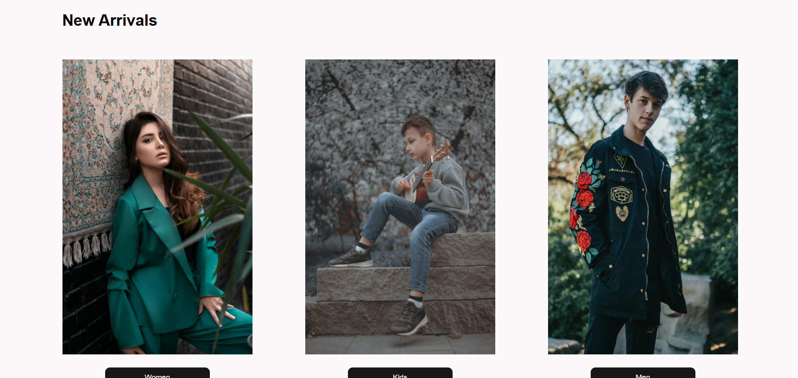
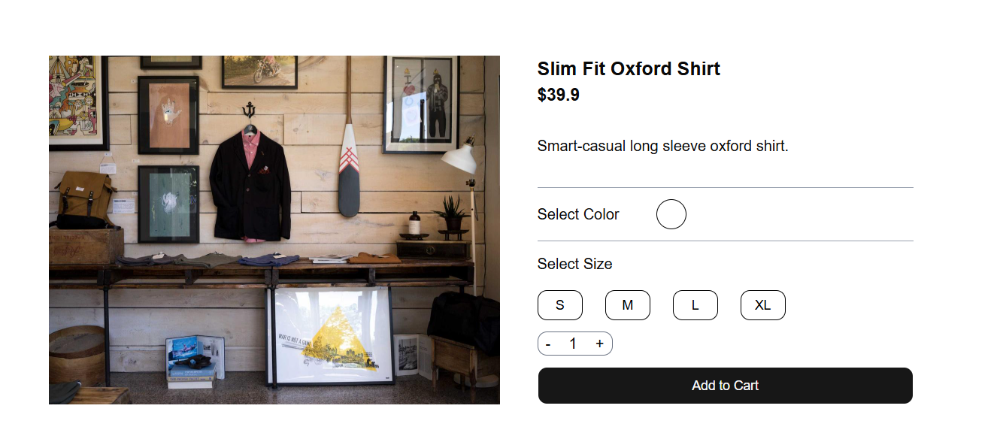
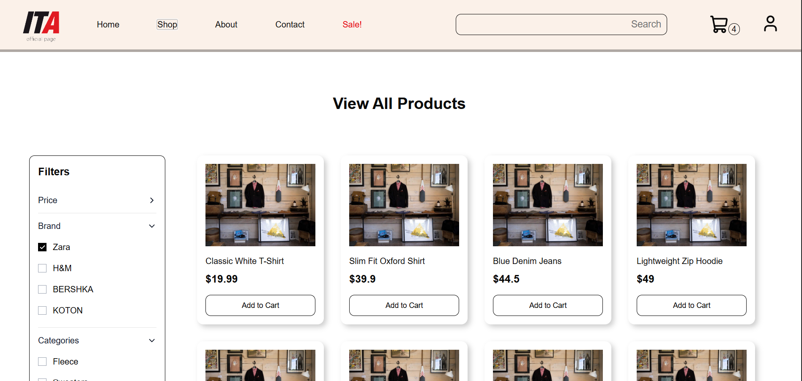
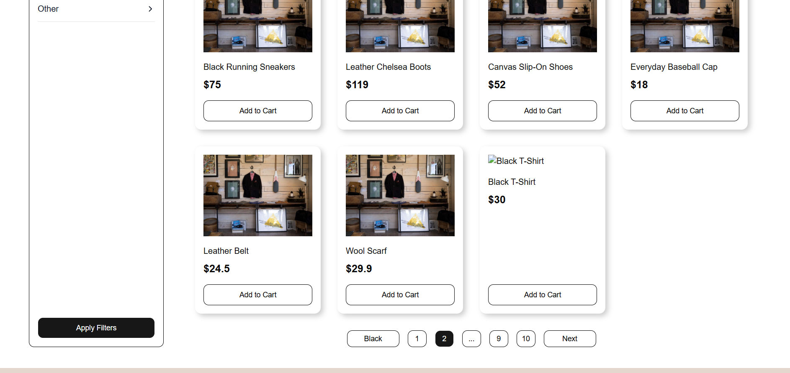
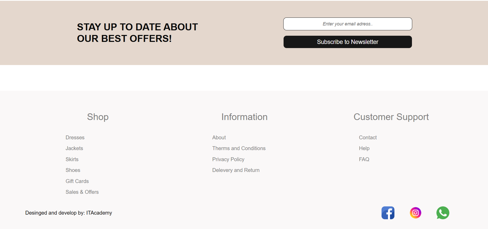
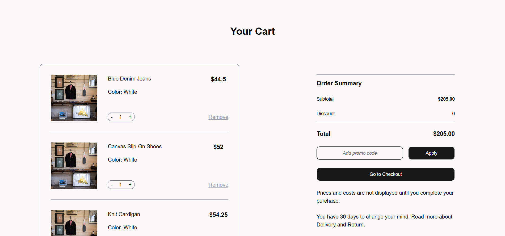
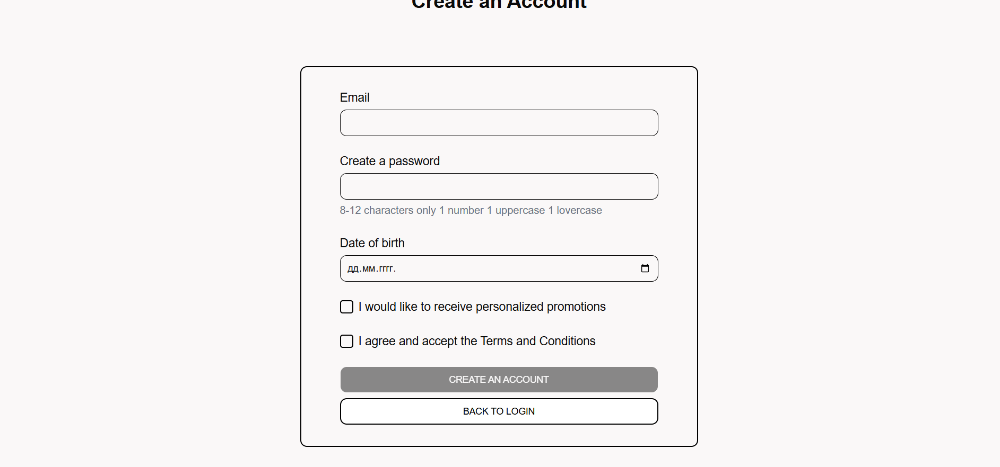
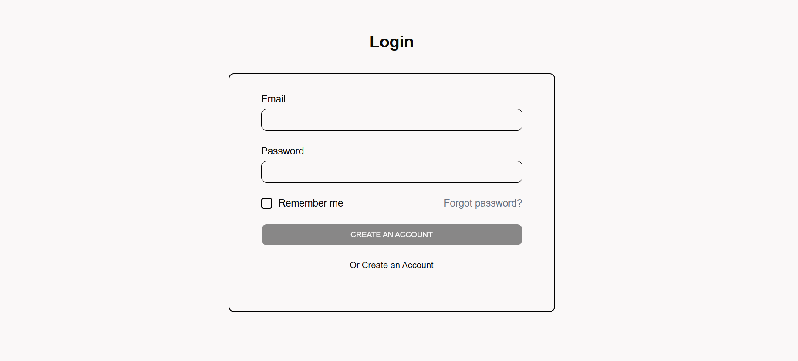

# Final Project

##  About the Project

This project was developed during my education and web development course with the goal of applying and improving the knowledge I gained throughout the course.

The main purpose of the project was to demonstrate my understanding of the technologies we worked with and to bring together the different concepts and exercises into one complete and functional e-commerce web application.

The project represents a practical application of the knowledge I gained during the course, including website structure, styling, JavaScript logic, React components, API integration, data management, and project organization.

##  Project Goal

The main goals of this project were:

* To apply the knowledge gained during the course
* To improve my practical web development skills
* To demonstrate my understanding of HTML, CSS, JavaScript, and React
* To practice working with reusable components
* To learn how to organize a React project
* To work with APIs and external data
* To create a functional e-commerce application
* To improve my understanding of clean and organized code
* To combine different technologies into one complete project

A special focus was placed on creating a well-organized application where all parts work together as one functional system.

##  Technologies Used

* **HTML** - used for the structure of the application
* **CSS** – used for styling and layout
* **JavaScript** – used for application logic and data manipulation
* **React** – used for building reusable components and the user interface
* **Tailwind CSS** – used for styling and responsive design
* **API** – used for retrieving and sending data between the application and the server

##  Features

The application includes various e-commerce features, such as:

* Home page
* Product listing
* Product details
* Adding products to the shopping cart
* Increasing and decreasing product quantities
* Removing products from the cart
* Displaying the total price
* User registration
* User login
* Checkout page
* Shipping information form
* API integration
* Fetching product data from the API
* Sending user and product data to the server
* Dynamic rendering of products and application data

##  API Integration

One of the important parts of the project was working with an API.

Product information is retrieved from the server and then used to dynamically display products within the application.

The API is also used during the checkout process to send information about the user and selected products back to the server.

This makes the project more than just a static website, as it communicates with a backend server and works with real application data.

##  Project Structure

The project is organized using React components in order to make the code more readable, reusable, and easier to maintain.

Different parts of the application are separated into components based on their purpose and functionality.

During the development of this project, I practiced working with:

* React components
* Props
* State
* Context API
* React Router
* Forms and form handling
* Event handling
* API requests
* Data management
* Reusable components
* Responsive design

## Screenshots

Home Page

  
  

           
Product Details

Shop

  
  
  

Shopping Cart

Checkout

Login

##  What I Learned

Through this project, I improved my knowledge of frontend development and gained more practical experience in combining different web technologies.

I especially improved my understanding of React, component organization, API integration, state management, data handling, an
